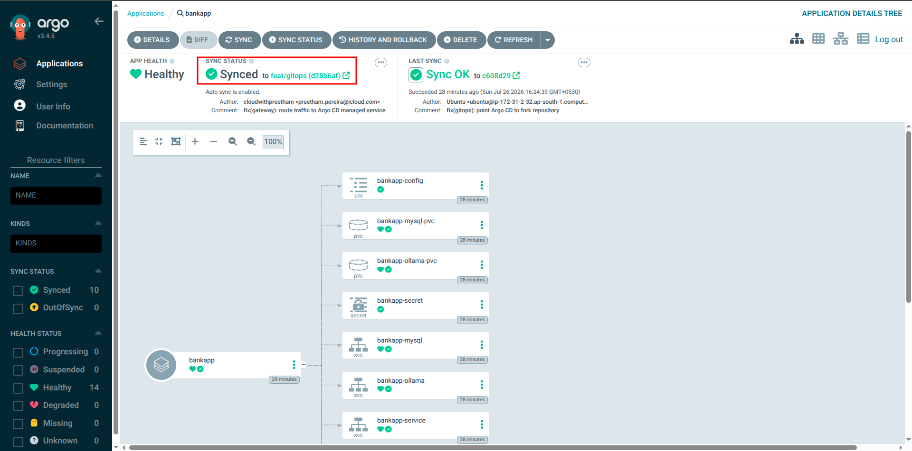
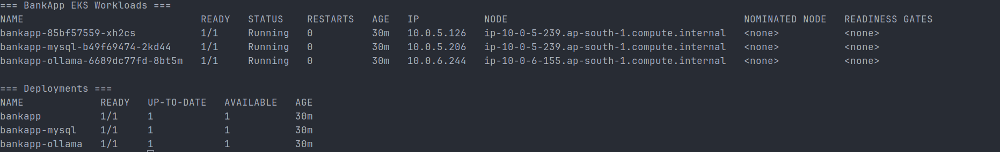
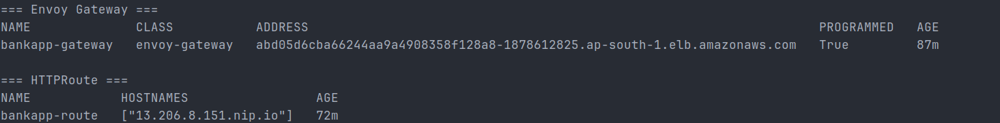
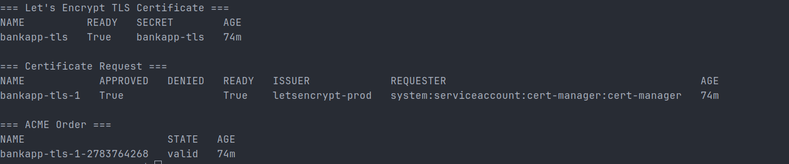
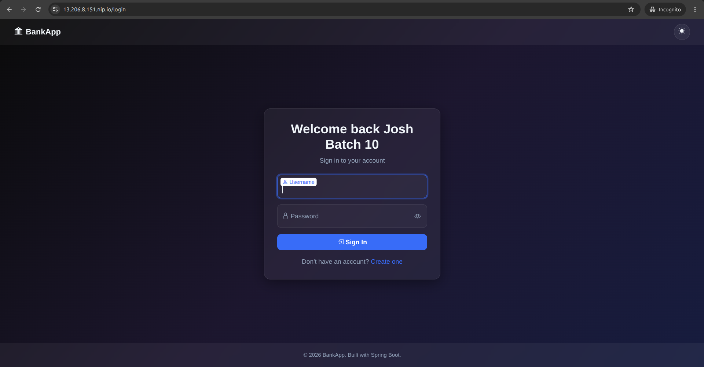
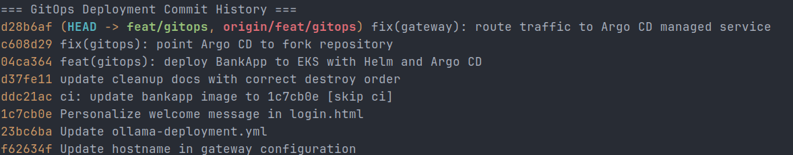

<div align="center">

# AI BankApp

### End-to-End GitOps on Amazon EKS

A modern banking application with an integrated AI chatbot, deployed on AWS EKS using Terraform, ArgoCD, Gateway API, and Prometheus monitoring.

[](https://www.oracle.com/java/technologies/javase/jdk21-archive-downloads.html)
[](https://spring.io/projects/spring-boot)
[](https://aws.amazon.com/eks/)
[](https://argo-cd.readthedocs.io/)
[](https://www.terraform.io/)
[](https://hub.docker.com/)

---


</div>

---

## Features

- **Banking Operations** — Deposit, withdraw, transfer funds between accounts
- **AI Chatbot** — Context-aware financial assistant powered by Ollama (TinyLlama), self-hosted on Kubernetes
- **Dark/Light Mode** — Glassmorphism UI with theme toggle and localStorage persistence
- **Spring Security** — BCrypt password hashing, CSRF protection, form-based authentication
- **Prometheus Metrics** — Built-in `/actuator/prometheus` endpoint for monitoring

---

## Architecture

<div align="center">


</div>

| Layer | Tool |
|-------|------|
| **Infrastructure** | Terraform (VPC + EKS + ArgoCD) |
| **CI Pipeline** | GitHub Actions → DockerHub |
| **GitOps / CD** | ArgoCD (auto-sync from `k8s/` manifests) |
| **Ingress** | Gateway API + Envoy Gateway (AWS NLB) |
| **TLS** | cert-manager + Let's Encrypt (auto-provisioned) |
| **Monitoring** | kube-prometheus-stack (Prometheus + Grafana) |
| **AI Chatbot** | Ollama (TinyLlama) on EKS |
| **Storage** | EBS CSI Driver (gp3 dynamic provisioning) |

---

## What Gets Deployed

| Resource | Details |
|----------|---------|
| **EKS Cluster** | Kubernetes 1.35, 3x `t3.medium` across 3 AZs |
| **BankApp** | 2 replicas with HPA (scales to 4), rolling updates |
| **MySQL 8.0** | Persistent EBS volume (gp3) |
| **Ollama AI** | TinyLlama model with persistent storage |
| **Gateway** | HTTPS with Let's Encrypt TLS, session persistence |
| **Monitoring** | Prometheus + Grafana dashboards |
| **ArgoCD** | Auto-sync, self-heal, prune |

---

## Quick Start

> Full step-by-step commands with troubleshooting: [`DEPLOYMENT.md`](DEPLOYMENT.md)

```bash
# 1. Provision infrastructure (~15 min)
cd terraform && terraform init && terraform apply

# 2. Configure kubectl
aws eks update-kubeconfig --name bankapp-eks --region us-west-2

# 3. Install Envoy Gateway + cert-manager + Prometheus
#    (see DEPLOYMENT.md Steps 4-6)

# 4. Deploy via ArgoCD
kubectl apply -f argocd/application.yml

# 5. Pull AI model
kubectl exec -n bankapp deploy/ollama -- ollama pull tinyllama
```

---

## CI/CD — GitOps Deployment Flow

The BankApp uses a declarative GitOps deployment model with **Argo CD, Helm, Amazon EKS, Envoy Gateway, and cert-manager**.

```text
Developer
    │
    │ git push
    ▼
GitHub Repository
    │
    │ feat/gitops
    ▼
Argo CD
    │
    │ Detects Git changes
    ▼
Helm Chart
    │
    │ values-dev.yaml
    ▼
Amazon EKS
    │
    ├── BankApp
    ├── MySQL
    └── Ollama
    │
    ▼
Envoy Gateway
    │
    │ Gateway API
    ▼
cert-manager
    │
    │ Let's Encrypt TLS
    ▼
HTTPS BankApp
```

### How the GitOps Flow Works

1. Deployment changes are pushed to the `feat/gitops` branch.
2. **Argo CD** monitors the Git repository for changes.
3. Argo CD loads the Helm chart from `helm-chart/bankapp`.
4. Helm renders the Kubernetes resources using `values-dev.yaml`.
5. Argo CD automatically synchronizes the desired state to Amazon EKS.
6. `selfHeal: true` restores resources when cluster state drifts from Git.
7. `prune: true` removes resources deleted from the Git-managed configuration.
8. **Envoy Gateway** routes external traffic to `bankapp-service`.
9. **cert-manager** manages TLS certificates for secure HTTPS access.

The Argo CD Application deploys:

```text
Repository:     cloudwithpreetham/AI-BankApp-DevOps
Branch:         feat/gitops
Path:           helm-chart/bankapp
Values:         values-dev.yaml
Namespace:      bankapp
Auto Sync:      Enabled
Self Healing:   Enabled
Pruning:        Enabled
```

---

## GitOps Deployment Verification

The final deployment was verified across the complete GitOps delivery path.

### 1. Argo CD — Synced & Healthy

Argo CD successfully reconciled the Helm chart from Git with the Amazon EKS cluster.

```text
Sync Status:   Synced
Health Status: Healthy
```



---

### 2. BankApp Workloads Running on Amazon EKS

The GitOps-managed application stack is running successfully on Amazon EKS.

The deployed workloads include:

- BankApp
- MySQL 8.0
- Ollama

All three deployments reached their expected ready state.



---

### 3. Envoy Gateway Programmed

Envoy Gateway provides external application traffic routing using the Kubernetes Gateway API.

The `bankapp-gateway` successfully reached:

```text
PROGRAMMED: True
```

The `bankapp-route` HTTPRoute is attached to the Gateway and routes requests to the Argo CD-managed BankApp service.

```text
HTTPRoute
    │
    ▼
bankapp-service:8080
    │
    ▼
BankApp Pod
```



---

### 4. Automated TLS with Let's Encrypt

cert-manager successfully provisioned the BankApp TLS certificate through the configured Let's Encrypt issuer.

Verification:

```text
Certificate:         bankapp-tls
Certificate Ready:   True
CertificateRequest:  Ready
Issuer:              letsencrypt-prod
ACME Order:          valid
```



---

### 5. BankApp Accessible over HTTPS

The application is externally accessible through Envoy Gateway using HTTPS.

```text
Client
  │
  │ HTTPS :443
  ▼
AWS Load Balancer
  │
  ▼
Envoy Gateway
  │
  ▼
HTTPRoute
  │
  ▼
bankapp-service:8080
  │
  ▼
BankApp Pod
```

HTTPS verification successfully returned an HTTP redirect to the BankApp login page.



---

### 6. GitOps Commit History

The deployment configuration is maintained in Git on the `feat/gitops` branch.

The final GitOps changes include:

- Helm-based BankApp deployment
- Environment-specific Helm values
- Argo CD Helm integration
- Automated synchronization and self-healing
- Repository source correction
- Envoy Gateway routing correction
- Amazon EKS deployment configuration
- HTTPS and TLS integration



---

## Project Structure

```text
AI-BankApp-DevOps/
│
├── argocd/
│   └── application.yml
│
├── helm-chart/
│   └── bankapp/
│       ├── Chart.yaml
│       ├── values.yaml
│       ├── values-dev.yaml
│       ├── values-staging.yaml
│       ├── values-prod.yaml
│       │
│       └── templates/
│           ├── _helpers.tpl
│           ├── configmap.yaml
│           ├── deployment.yaml
│           ├── hpa.yaml
│           ├── mysql-deployment.yaml
│           ├── ollama-deployment.yaml
│           ├── pvc.yaml
│           ├── secret.yaml
│           ├── service.yaml
│           │
│           ├── hooks/
│           │   └── pre-install-job.yaml
│           │
│           └── tests/
│               └── test-connection.yaml
│
├── k8s/
│   ├── gatewayclass.yml
│   ├── gateway.yml
│   ├── cert-manager.yml
│   └── ...
│
├── terraform/
│   ├── provider.tf
│   ├── variables.tf
│   ├── terraform.tfvars
│   ├── vpc.tf
│   ├── eks.tf
│   ├── argocd.tf
│   ├── outputs.tf
│   └── README.md
│
├── docs/
│   └── screenshots/
│       └── gitops/
│           ├── 01-argocd-synced-healthy.png
│           ├── 02-eks-bankapp-pods-running.png
│           ├── 03-envoy-gateway-programmed.png
│           ├── 04-letsencrypt-certificate-ready.png
│           ├── 05-bankapp-https-login.png
│           └── 06-gitops-commit-history.png
│
├── setup-k8s/
│   └── kind-config.yaml
│
├── DEPLOYMENT.md
├── README.md
└── .gitignore
```

### Key Directories

| Directory | Purpose |
|---|---|
| `terraform/` | Provisions AWS networking, Amazon EKS, and supporting infrastructure |
| `helm-chart/bankapp/` | Defines the deployable BankApp Helm chart |
| `argocd/` | Defines the Argo CD GitOps Application |
| `k8s/` | Contains Gateway API, TLS, and supporting Kubernetes resources |
| `docs/screenshots/gitops/` | Stores final deployment verification screenshots |
| `setup-k8s/` | Contains local Kubernetes development configuration |

---

## Documentation

| Document | Purpose |
|----------|---------|
| [`DEPLOYMENT.md`](DEPLOYMENT.md) | Step-by-step deployment commands + gotchas |
| [`terraform/README.md`](terraform/README.md) | Detailed infrastructure setup + troubleshooting |

---

## Tech Stack

**Backend:** Java 21, Spring Boot 3.4.1, Spring Security, Thymeleaf, Actuator

**Frontend:** Bootstrap 5, glassmorphism dark/light UI, CSS custom properties

**AI:** Ollama with TinyLlama — self-hosted, zero cost, runs as a Kubernetes pod

**Database:** MySQL 8.0 with EBS gp3 persistent volumes

**DevOps:** Terraform, GitHub Actions, ArgoCD, Envoy Gateway, cert-manager, kube-prometheus-stack

---

<div align="center">

**TrainWithShubham** — Happy Learning

</div>
